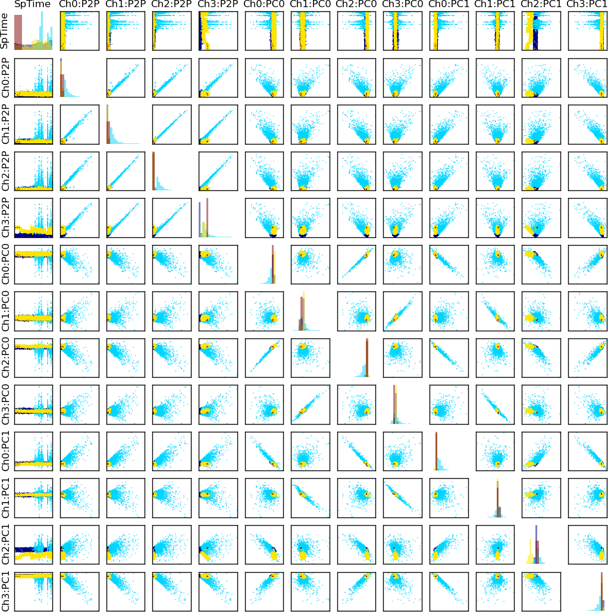

.. _beans_tutorial:

Interactive spike sorting
=========================

This tutorial shows the basic procedure of detecting, sorting, and
exporting the spike data with the SpikeSort software. Here, we use the
built-in component based command-line interface SpikeBeans, which is
very easy to use.
 
You will also find the information on how to adjust the provided
scripts for your needs.
 
.. note:: 

   The procedure described in this tutorial can also be
   implemented using the SpikeSort's methods directly (see
   :ref:`lowlevel_tutorial`).

The procedure consists of three steps:

* Reading the data
* Spike sorting
* Exporting results

1. Reading the data
-------------------

Before you can start spike sorting you have to load data with raw extracellular
recordings. Such data can be obtained from microelectrodes, tetrodes or shank
electrodes. SpikeSort currently supports data saved in custom binary and HDF5 format
but new formats can be easily added.
   
To start with, you can download a sample `data file`_. 

This hierarchical file is organized as following::
   
   /subject/session/electrodeid
      
For example, data from electrode `el1` recorded in session `session01` of 
subject `SubjectA` can be found under `/SubjectA/session01/el1`
   
I will assume that you downloaded this file and saved it to :file:`data` 
directory.

The fastest way prepare the data, is to use the provided script :file:`cluster_beans.py`
which can be found in the :file:`SpikeSort/examples/sorting/` directory. By default, the script
is configured and ready to use with the tutorial data. For now, we'll use the unmodified version.
However, you can find the detailed information on how to adapt the script for your needs at the end
of this tutorial.

Before you run the script, create the environment variable called DATAPATH which points to the folder
where the data is located. On UNIX-based systems, it can be added from the terminal as follows::

	$ export DATAPATH='where/your/data/is/located'
	
Then, just fire it up from the python shell in the interactive mode::

	$ python -i cluster_beans.py

or, alternatively, within the `ipython <http://ipython.org>`_  interactive shell::

	$ ipython cluster_beans.py

Now everything is ready to start sorting the spikes.

.. note::

   IPython is an enhanced Python interpreter that provides high-level
   editting functions, such as tab-completion, call-tips, advanced command 
   history and documentation access. It is the recommended way of
   working with SpikeSort.
   
2. Spike sorting
----------------

A. Visualizing the data
^^^^^^^^^^^^^^^^^^^^^^^

To provide some useful data visualization tools, the :file:`cluster_beans.py` creates four plotting objects:
	
* *browser* - the Spike Browser
* *plot1* - feature space viewer
* *plot2* - spike waveshape viewer
* *legend* - legend of the colour code used in all plots 
	
In order to see the output of such an object, just call its :py:func:`show` method, e.g.::
   
   
	>>> browser.show()	

Each plotting component is described in detail below.

.. figure:: images_beans/browser_nozoom.png
   :width: 100 %

   *Spike Browser*

   The four horizontal black curves are the [filtered] voltage traces recorded
   from different channels (channel 0 at the bottom and 3 at the top) of the electrode
   `el1` (can be changed in the script). The color segments are the detected spikes'
   waveshapes. The correspondence between color and cell index can be found in the legend.

   Use the "+" and "-" keys to scale the vertical axis, and the "Prev" and "Next"
   buttons to navigate across the temporal axis. Now it looks more comprehensible:
   
.. figure:: images_beans/browser_zoom.png
   :scale: 70

   *Spike browser after scale adjustment.*
   

   *Feature plot*

   To sort the spikes, some characteristic features that may be used to differentiate
   between the waveshapes have been calculated (e.g. peak-to-peak amplitude,
   projections on the principal components).
   
   To help the user identify the features, all features have short labels. For example, feature ``Ch0:P2P`` denotes peak-to-peak amplitude in contact 
   (channel) 0.
   
   The Feature space viewer plots the spikes' projections in the feature space 
   (pair-wise 2D plots) and 1D projection histograms for each feature
   (on the diagonal). The plot is symmetric - the upper triangle is
   the same as the lower.

   .. note::
   
       Depending on how many features are viewed, the subplots may be too small.
       To zoom in/out the subplot, target it with the mouse and press the "z" key.
    

.. figure:: images_beans/waves.png
   :scale: 50

   *Spike waveshape plot*

   This component plots the aligned and overlapped spike waveshapes. The spikes
   recorded from different channels are shown in different subplots
   arranged from left to right and from top to bottom. 
   
   You can also zoom the subplots here as in the Feature space viewer.

|

*Legend*

For the convenience, the legend is plotted in a separate figure.   

   
B. Managing the spikes
^^^^^^^^^^^^^^^^^^^^^^

The aim of the spike sorting is to differentiate one or several cells' spikes
from  each other and from other activity (such as background noise or stimulus artifacts).
This can be partially done by the automatic clustering in the feature space.
However, for the reliable results, some manual manipulations are needed and the
best settings have to be identified using trial-and-error procedure. It usually
involves removing/merging cells (clusters), reclustering the data, and changing
the spike detection threshold.
   
Before we proceed, it will be convenient to create some aliases::
   
	>>> ca = base.features['LabelSource']         # points to the ClusterAnalyzer 
	>>> sd = base.features['SpikeMarkerSource']   # points to the SpikeDetector

.. note::

   SpikeSort beans interface consists of independent components each
   performing one step of spike sorting. :py:attr:`base.features` is a
   container with these components. The keys in this container
   (`LabelSource` and `SpikeMarkerSource`) describe the functionality that
   the components provide: `LabelSource` provides cluster labels and
   `SpikeMarkerSource` provides the times of detected spike events. In
   this example we search for the components by their functions.

Looking at the spike waveshapes, one might find, that the blue "Cell 2" (in your case, it may have
different index and/or coloring since the clustering algorithm uses random initial state)
is most probably not really a cell, but some noise. Thus, it is not interesting and we want
to **remove** it.
  
To remove one or more cells (i.e. clusters), you have to look up their id's
in the legend and then pass them as arguments to the :py:func:`ca.delete_cells` function::
   
    >>> ca.delete_cells(2)
      
After we got rid of the unnesessaey stuff, the waveshape plot looks as follows:

|

	.. image:: images_beans/waves_2_deleted.png
		:scale: 50

|

All the deleted "spikes" are now assigned the id 0, which can be considered as a trash.
  
Sometimes the clustering algorithm splits one cell into two clusters. In such cases
it is convenient to **merge** them back into a single cell. In our example, there is no
need to merge anything. However, cells 1 and 4 (blue and brown) also look like trash,
so let's merge them (just as a practice) and delete afterwards.
     
The merging procedure is similar to deletion -
:py:func:`ca.merge_cells` function takes as arguments IDs of all cells
to be merged into one group::
   
    >>> ca.merge_cells(1,4)	# after merging, they form a cell with index 1
    >>> ca.delete_cells(1)	# removing the cell 1
      
Note that the new cell has an ID of one: the new cluster takes the
lowest of the IDs of merged clusters. Now, only the cluster with real
spikes is left (brown):

|

	.. image:: images_beans/waves_one_left.png
		:scale: 50

|
   
Sometimes, we need to break (**recluster**) the cluster into two or more (again, 
because of the incorrect clustering).

To do so, use the :py:func:`ca.recluster` function::
   
    >>> ca.recluster(1, 'gmm', 2) 	

where the arguments are: `cell to recluster`, `clustering algorithm`, and the `number of new clusters`. 

.. note::

   There are several automatic, semi-automatic and manual methods for clustering.
   Their performance and accuracy depends to large degree on a particular dataset
   and recording setup. In SpikeSort you can choose from several available methods,
   whose names are given as the first argument of :py:func:`spike_sort.cluster.cluster`
   method. The 'gmm' shortcut used in this example, means the Gaussian Mixture Model algorithm

In practice, it may happen that the **threshold** used during the spike detection is too
high to detect some important activity or too low to leave the noise out. In this case
you can easily change it (as well as any other SpikeDetector property) adjusting the
corresponding SpikeDetector property::
 
    >>> sd.threshold = 90
    >>> sd.update()

The :py:meth:`update` method informs all the subsequent components
that some parameters have been changed and the analysis has to be
repeated. When the calculations finish all the plots should be updated
automatically.
      
3. Exporting the results
------------------------   
   
Once you are done with the cells' differentiation, it is necessary to save the results
somewhere. Depending on the type of the data used, the differentiated spike times
can be stored differently. The tutorial data is in the *HDF5* format, so the
results will be stored inside the initial :file:`tutorial.h5` file.
   
To export the data we'll use an instance of the :py:class:`ExportCells` component
that writes the data back to :file:`tutorial.h5`:: 
   
    >>> export.export()
      
If everything went fine, a new array should be created in the file at
node `/SubjectA/session01/el1/cellX`, where X is the index of the
cell.

Good luck with hunting for spikes!!!

Customizing the script
----------------------

The example script :file:`spike_beans.py` can be easily adjusted to fit your
needs and used with the real data. Here we list the number of fields you might
want to adjust:

* **hd5file**		is the name of the data file (e.g. `\'tutorial.h5\'`)
* **dataset** 		specifies the data we are interested in (e.g. `/SubjectA/session01/el1`)
* **contact** 		sets the contact (channel) for the initial spike detection (e.g. `3`)
* **type** 			the type of spike waveshapes' alignment (e.g. `\'max\'` - align by the peak value)
* **thresh** 		sets the threshold for the automatic spike detection  (e.g. `70`)
* **filter_freq** 	specifies the filter properties in the form (see scipy.signal.iirdesign documentation) `(pass freq, cut-off freq[, gpass, gstop, ftype])` (e.g. `(800., 100., 1, 7, 'butter')`)
* **sp_win** 		specifies the window for spike alignment (e.g. `[-0.6, 0.8]`)

Additionally, you can add some features to be taken into account during clustering
and sorting, using the :py:func:`add_feature` function of the
:py:class:`FeatureExtractor` instance. Again, it's pretty intuitive.

Adding the peak-to-peak feature::

   >>> base.features["FeatureSource"].add_feature("P2P")
   
Adding projections on 3 Principal Components to the feature list::

   >>> base.features["FeatureSource"].add_feature("PCs", ncomps=3)

|
|
|

.. _data file: https://www.unic.cnrs-gif.fr/owncloud/index.php/s/fQC80tp6PWoUh2F/download

